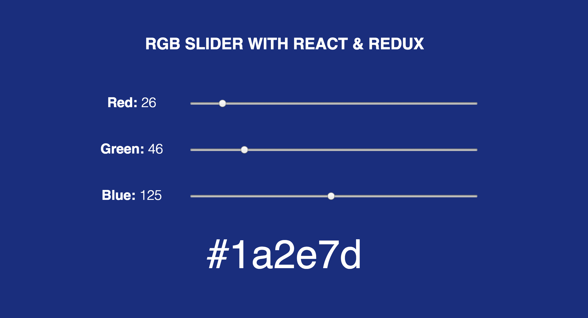
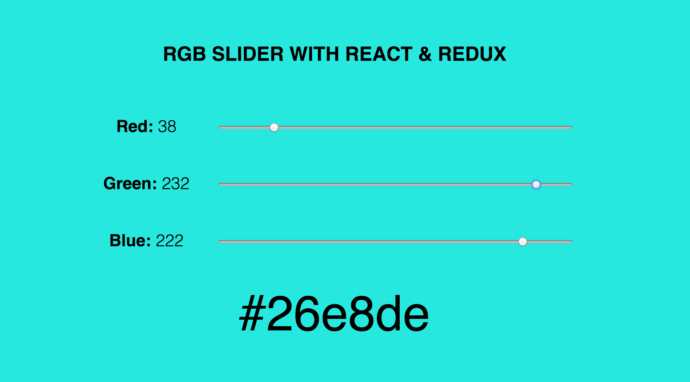
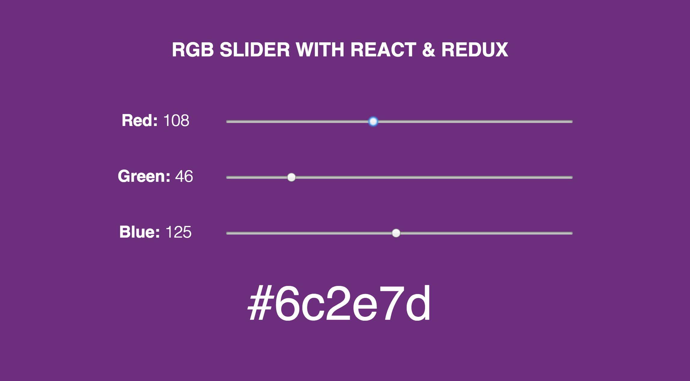
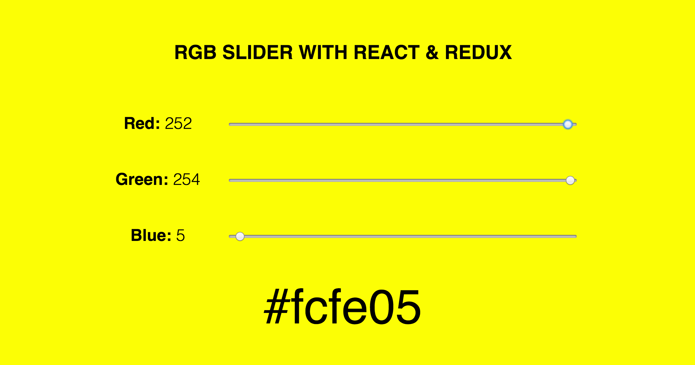

# Simple RGB Slider with React & Redux 
An example RGB Slider App that changes the background-color of the page according to input range slider values and shows the hexadecimal color code of the background. It is built with React.js, using Redux for state management. 

## Usage
* Download the files and place them in your project directory
* Run `npm i` to install the dependencies
* Run `npm start` to launch the development server

## Screenshots

